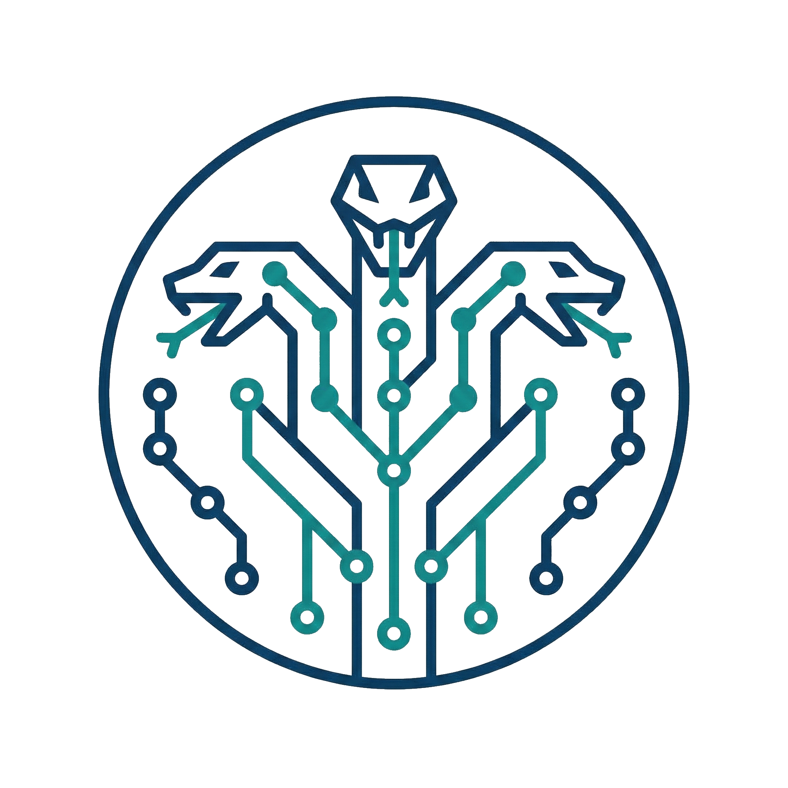

<p align="center">
  
</p>

<h1 align="center">Hydra</h1>

<p align="center">
  <strong>Multi-agent code orchestration control center</strong>
</p>

<p align="center">
  Run multiple coding agents in parallel on isolated git worktrees, score their outputs deterministically, and merge the best result safely.
</p>

---

## What is Hydra?

Hydra eliminates the manual overhead of working with multiple AI coding agents. Instead of creating branches, launching agents one by one, diffing outputs, and manually merging — Hydra does it all in one command.

- **Race Mode** — Run Claude, Codex, or other agents on the same task simultaneously
- **Deterministic Scoring** — Evaluate each agent's output on build, tests, lint, diff scope, and speed
- **Safe Merge** — Dry-run conflict detection before committing to a merge
- **Workflow Presets** — Builder-Reviewer-Refiner, Specialization, and Iterative Refinement patterns
- **Desktop GUI** — Tauri-based visual dashboard for monitoring races and reviewing results

## Supported Agents

| Agent | Tier | Status |
|-------|------|--------|
| Claude Code | Tier-1 | Fully supported |
| OpenAI Codex | Tier-1 | Fully supported |
| Cursor Agent | Experimental | Opt-in only |

## Quick Start

### Prerequisites

- Rust stable toolchain (1.70+)
- Git
- At least one supported agent CLI installed and authenticated (`claude` or `codex`)

### Build

```bash
cargo build --release -p hydra-cli
```

### Check Readiness

```bash
./target/release/hydra doctor
```

```
Hydra Doctor Report
===================

Git:
  ✓ git available (version 2.47.0)
  ✓ inside git repository

Adapters:
  ✓ claude: ready (v1.0.33) [Tier-1]
  ✓ codex: ready (v0.1.0) [Tier-1]
  - cursor-agent: missing [Experimental]

Overall: READY
```

### Run a Race

```bash
# Single agent
hydra race --agents claude --prompt "Add input validation to the signup form"

# The agent runs in an isolated worktree — your working tree stays clean
```

### Run a Workflow

```bash
# Builder-Reviewer-Refiner: build with Claude, review with Codex, refine with Claude
hydra workflow --preset builder-reviewer \
  --agents claude,codex,claude \
  --prompt "Refactor the authentication module"

# Iterative Refinement: re-run until quality threshold is met
hydra workflow --preset iterative \
  --agents claude \
  --prompt "Optimize database queries" \
  --score-threshold 90 \
  --max-iterations 5
```

### Merge Results

```bash
# Preview first
hydra merge --source hydra/<run-id>/agent/claude

# Then merge
hydra merge --source hydra/<run-id>/agent/claude --confirm
```

### Launch the GUI

```bash
cd crates/hydra-app
npm install
cargo tauri dev

# On Hyprland/Wayland, you may need:
# WEBKIT_DISABLE_DMABUF_RENDERER=1 cargo tauri dev
```

## Configuration

Create a `hydra.toml` in your project root:

```toml
[scoring]
profile = "rust"               # "rust", "js-node", "python", or "custom"
timeout_per_check_seconds = 300

[scoring.weights]
build = 30
tests = 30
lint = 15
diff_scope = 15
speed = 10

[scoring.gates]
require_build_pass = true
max_test_regression_percent = 0

[scoring.diff_scope]
protected_paths = ["infra/", "scripts/release/"]

[budget]
max_cost_usd = 5.00
```

## Architecture

```
┌─────────────────────────────────────────────────┐
│                   User                          │
│              CLI  or  GUI                       │
├─────────────────────────────────────────────────┤
│                hydra-core                       │
│  ┌───────────┐ ┌──────────┐ ┌───────────────┐  │
│  │ Adapter   │ │ Worktree │ │   Process     │  │
│  │ Registry  │ │ Service  │ │  Supervisor   │  │
│  └───────────┘ └──────────┘ └───────────────┘  │
│  ┌───────────┐ ┌──────────┐ ┌───────────────┐  │
│  │ Scoring   │ │  Merge   │ │   Workflow    │  │
│  │ Engine    │ │ Service  │ │    Engine     │  │
│  └───────────┘ └──────────┘ └───────────────┘  │
│  ┌───────────┐ ┌──────────┐ ┌───────────────┐  │
│  │ Artifacts │ │ Security │ │  Budget &     │  │
│  │ & Events  │ │ Sandbox  │ │  Observability│  │
│  └───────────┘ └──────────┘ └───────────────┘  │
├─────────────────────────────────────────────────┤
│    Agent Adapters (Claude, Codex, Cursor)       │
│    Isolated Git Worktrees                       │
└─────────────────────────────────────────────────┘
```

### Crate Structure

| Crate | Purpose |
|-------|---------|
| `hydra-core` | Library: orchestration, scoring, merge, adapters |
| `hydra-cli` | Binary: CLI frontend via clap |
| `hydra-app` | Tauri v2 + React: desktop GUI |

## Scoring

Hydra scores each agent's output across five dimensions:

| Dimension | Weight | What it measures |
|-----------|--------|------------------|
| Build | 30 | Does it compile? |
| Tests | 30 | Pass rate, regressions, new test bonus |
| Lint | 15 | New errors/warnings vs baseline |
| Diff Scope | 15 | Focused changes vs excessive churn |
| Speed | 10 | Relative execution time |

Scores are deterministic and reproducible from saved artifacts.

## Security

- Agent processes run in isolated git worktrees
- Secret patterns (API keys, tokens) are redacted from logs and artifacts
- Sandbox enforcement prevents writes outside the assigned worktree
- Unsafe mode requires explicit per-run opt-in with visible warnings

## Development

```bash
# Run all tests (368 tests)
cargo test --all

# Lint
cargo clippy --all-targets -- -D warnings

# Format
cargo fmt
```

## License

MIT
